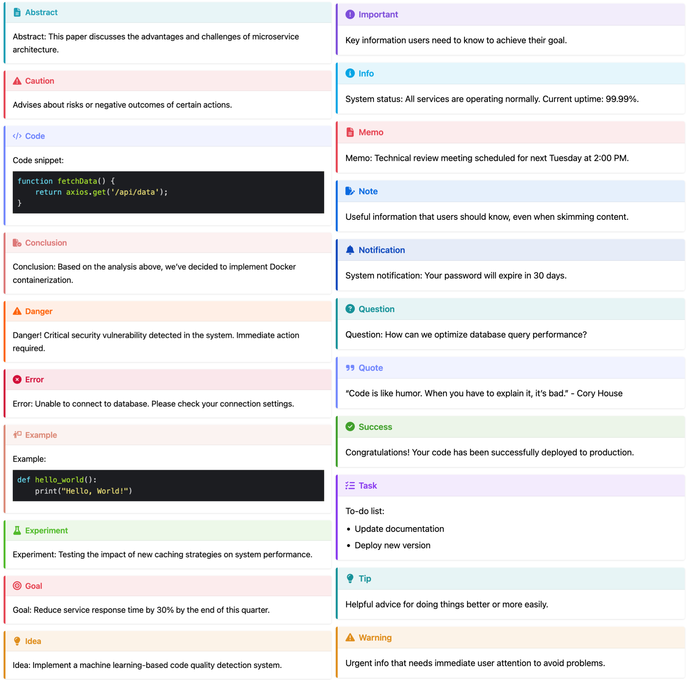
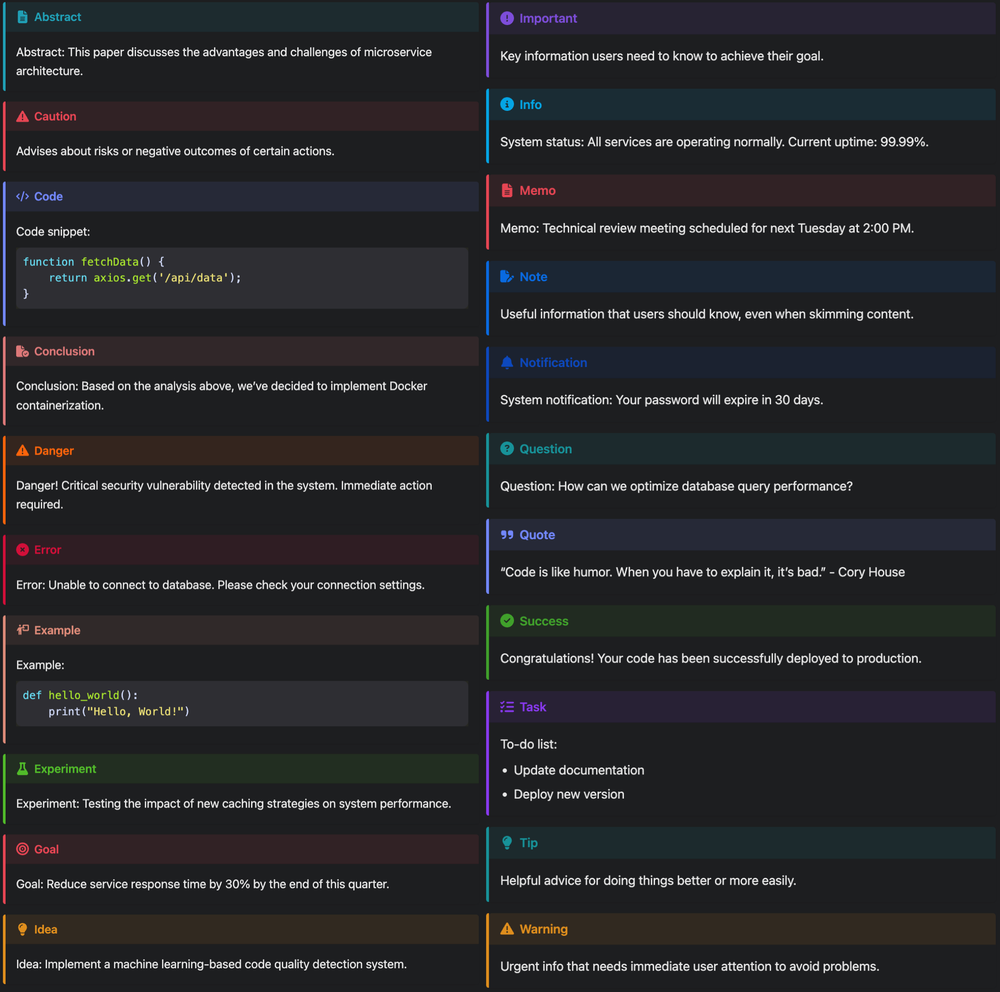

# hugo-admonitions

A lightweight Hugo module that adds beautiful and customizable admonition blocks to your content.

Inspire from [mdbook-admonish](https://tommilligan.github.io/mdbook-admonish/)

## Table of Contents

- [hugo-admonitions](#hugo-admonitions)
  - [Table of Contents](#table-of-contents)
  - [Features ✨](#features-)
  - [Overview of all admonitions](#overview-of-all-admonitions)
    - [Light Mode](#light-mode)
    - [Dark Mode](#dark-mode)
    - [Header Only Mode](#header-only-mode)
  - [Installation](#installation)
    - [Hugo Module](#hugo-module)
    - [Git Clone](#git-clone)
  - [Usage](#usage)
  - [Customization](#customization)
  - [Contributing](#contributing)
  - [License](#license)

## Features ✨

- Various beautiful and simple callout available 🎨
- Blockquote style 💬
  - Portable Markdown style (GitHub, Obsidian, Typora, etc.) 📝

  - ```md
    > [!WARNING]
    > Warning: This operation will delete all data.
    ```

- Dark mode support 🌙
- Header Only Mode 📑
- Multi-language support 🌐
  - English
  - Chinese
  - Swahili
  - German
  - [Localization PRs are always welcome!](https://github.com/KKKZOZ/hugo-admonitions/pulls)

## Overview of all admonitions

### Light Mode



### Dark Mode



### Header Only Mode

<div align="center">
  
</div>

## Installation

### Hugo Module

1. Install [Go programming language](https://go.dev/doc/install) in your operating system.

2. Initialize your own hugo module

```shell
hugo mod init YOUR_OWN_GIT_REPOSITORY
```

3. Add `hugo-admonitions` in your site's configuration file.

With `hugo.yaml`:

```yaml
module:
  imports:
    - path: github.com/KKKZOZ/hugo-admonitions
    - path: my-theme
```

With `hugo.toml`:

```toml
[module]
  [[module.imports]]
    path = "github.com/KKKZOZ/hugo-admonitions"
  [[module.imports]]
    path = "my-theme"
```

4. Finally update by running:

```shell
hugo mod get -u
```

### Git Clone

1. Inside the folder of your Hugo site, run:

```bash
git clone git@github.com:KKKZOZ/hugo-admonitions.git themes/hugo-admonitions --depth=1
```

2. Add `hugo-admonitions` as the left-most element of the theme list variable in your site's or theme's configuration file `hugo.yaml` or `hugo.toml`.

    Example, with `hugo.yaml`:

    ```yaml
    theme: ["hugo-admonitions", "my-theme"]
    ```

    or, with `hugo.toml`,

    ```toml
    theme = ["hugo-admonitions", "my-theme"]
    ```

## Usage

> See [callout-demo.md](./callout-demo.md) for complete callout usage examples

Use the blockquote in this way:

```markdown
> [!NOTIFY]
> System notification: Your password will expire in 30 days.
```


<details>
<summary>Available Callouts List</summary>

- `[!ABSTRACT]`
- `[!CAUTION]`
- `[!CODE]`
- `[!CONCLUSION]`
- `[!DANGER]`
- `[!ERROR]`
- `[!EXAMPLE]`
- `[!EXPERIMENT]`
- `[!GOAL]`
- `[!IDEA]`
- `[!IMPORTANT]`
- `[!MEMO]`
- `[!NOTE]`
- `[!NOTIFY]`
- `[!QUESTION]`
- `[!QUOTE]`
- `[!SUCCESS]`
- `[!TASK]`
- `[!TIP]`
- `[!WARNING]`

</details>

<br/>

> [!NOTE]
> Unsupported callout types will default to `[!NOTE]`

Or you can customize the title by using any of them:

```markdown
> [!IDEA] Summary
> This is a summary using the `IDEA` callout!
```


```markdown
> [!MEMO] Summary
> This is a summary using the `MEMO` callout!
```


You can choose to use the Header Only Mode!

- Just write a title without any contents

```markdown
> [!TIP] You can choose to only to show the header!

> [!NOTIFY] System notification: Your password will expire in 30 days

> [!SUCCESS] Congratulations! Your code has been successfully deployed to production

> [!WARNING] Warning: This operation will delete all data. 
```


## Customization

Override styles by copying the [source](./assets/sass/vendors/_admonitions.scss) into `assets/sass/vendors/_admonitions.scss` and changing as needed.

If you are still confused, see the detailed process below:

1. **Create the Directory Structure**
   - In your Hugo project's root directory, create the following folder structure:
   ```
   your-hugo-project/
   ├── assets/
   │   └── sass/
   │       └── vendors/
   ```

    This can be done by running:
    ```shell
    mkdir -p assets/sass/vendors
    ```

2. **Copy the Source File**
   - Copy the original `_admonitions.scss` file, which is located in `themes/hugo-admonitions/assets/sass/vendors/_admonitions.scss` 
   - Paste it into your project at: `assets/sass/vendors/_admonitions.scss`
   - This will override the module's default styles
  
   This can be done by running:
   ```shell
   cp themes/hugo-admonitions/assets/sass/vendors/_admonitions.scss assets/sass/vendors/_admonitions.scss
   ```

3. **Customize the Styles**
   - Modify the SCSS code according to your needs
   - Your changes will take precedence over the original module styles

## Contributing

Contributions are welcome! Please feel free to submit a [Pull Request](https://github.com/KKKZOZ/hugo-admonitions/pulls).

## License

This project is licensed under the MIT License - see the [LICENSE](LICENSE) file for details
